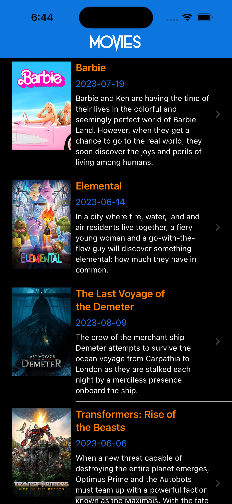
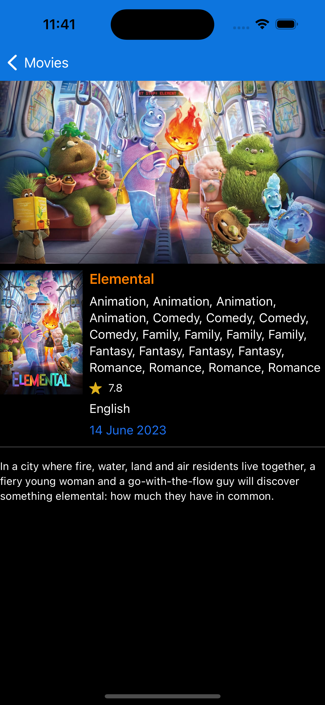

# MovieDB
Movie Database iOS App in SwiftUI

## Features
- Latest movies information.
- Endless Scrolling (Pagination based on themoviedb.org api data)
- Movie details (e.g. Poster, Rating, Language, Release Date, Overview)

## Screenshots
[Movies]
[Detail]

## Versioning

Version 1.0
For more information on versioning, see [Semantic Versioning](http://semver.org/).

## Authors

* **Ahmad Ansari** - (https://github.com/ahmadansari)

## License

This project is licensed under the MIT License - see the [LICENSE.md](LICENSE.md) file for details
